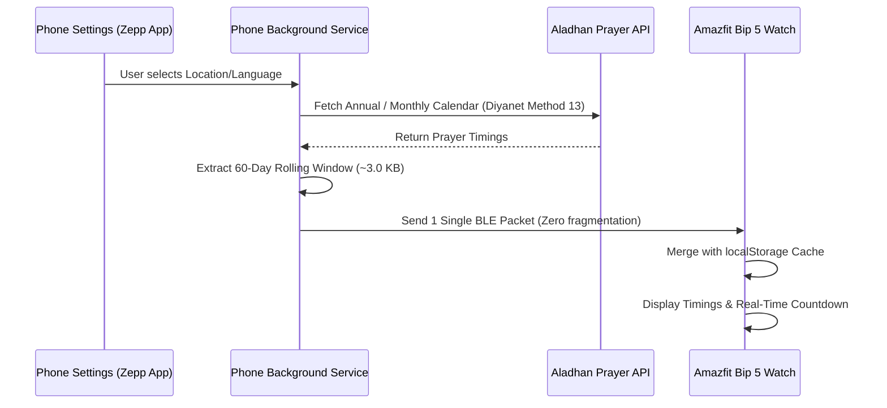

# Namaz Vakti (Prayer Times for Amazfit Bip 5)

[](https://docs.zepp.com/)
[-green.svg)](https://www.amazfit.com/)
[]()
[](https://github.com/alicontarli/namazvakti-amazfitbip5/releases/latest)
[](https://opensource.org/licenses/MIT)

`Namaz Vakti` (Prayer Times) is a modern, lightweight, and battery-efficient Zepp OS mini application designed specifically for the **Amazfit Bip 5** smartwatch.

It provides accurate daily prayer times, real-time countdown to the upcoming prayer, valid-until schedule tracking, and companion widget surfaces (`Shortcut Card` and `Secondary Widget`) for quick glance access right from your watch face.

---

## 🌟 Key Features

- **Accurate Prayer Times:** Fajr (Sabah), Dhuhr (Öğle), Asr (İkindi), Maghrib (Akşam), and Isha (Yatsı).
- **Live Countdown Timer:** Second-by-second live countdown to the next upcoming prayer.
- **Single-Packet 60-Day Rolling Schedule:** Transmits a compact 60-day rolling window (~3.0 KB) in a **single unfragmented BLE packet** to guarantee 100% reliable synchronization without Bluetooth chunk drops or timeouts.
- **Cumulative Local Memory:** Automatically merges incoming schedule days into the watch's local cache without wiping existing offline data.
- **Smart Expiration & Validity Indicator:** Displays schedule validity status directly on the watch (e.g. `Son: 24 Eki (60 gün)` / `Until: 24 Oct`) with automatic amber warnings (`Son 2 gün - Güncelle`) when the schedule runs low.
- **11-Language Localization:**
  - 🇹🇷 Türkçe (Turkish)
  - 🇬🇧 English
  - 🇸🇦 العربية (Arabic)
  - 🇧🇩 বাংলা (Bengali)
  - 🇪🇸 Español (Spanish)
  - 🇫🇷 Français (French)
  - 🇩🇪 Deutsch (German)
  - 🇷🇺 Русский (Russian)
  - 🇮🇷 فارسی (Persian)
  - 🇵🇰 اردو (Urdu)
  - 🇮🇩 Bahasa Indonesia (Indonesian)
- **Built-in Locations Database:**
  - All **81 Provinces of Turkey** (01 Adana – 81 Düzce).
  - Major world cities (Germany, UK, France, Netherlands, Belgium, Austria, Switzerland, Azerbaijan, Saudi Arabia, USA).
- **Multi-Surface Companion:**
  - Main Watch Application (`320x380`)
  - Shortcut Card (`app-widget` / `320x112`)
  - Secondary Widget (`secondary-widget` / `320x380`)

---

## 📥 How to Install on Amazfit Bip 5

### Method 1: Install using the `.zab` Release Package (Recommended)

1. Go to the [**GitHub Releases**](https://github.com/alicontarli/namazvakti-amazfitbip5/releases) page.
2. Download the latest compiled package: `namazvakti-bip5-v1.3.0.zab`.
3. Open the **Zepp App** on your smartphone:
   - Navigate to **Profile > Settings > About > Tap the Zepp icon 7 times** to unlock Developer Mode.
   - Go to **Profile > Amazfit Bip 5 > Developer Mode**.
   - Tap **Install Mini Program / Sideload (.zab)** and select the downloaded `.zab` file.
4. The app will install directly to your Amazfit Bip 5!

---

### Method 2: Build and Sideload from Source with Zeus CLI

1. **Install Prerequisites:**
   Ensure Node.js (v18 or v20 LTS) is installed, then install Zeus CLI:
   ```bash
   npm install -g @zeppos/zeus-cli
   ```

2. **Clone the Repository & Install Dependencies:**
   ```bash
   git clone https://github.com/alicontarli/namazvakti-amazfitbip5.git
   cd namazvakti-amazfitbip5
   npm install
   ```

3. **Build the Package:**
   ```bash
   zeus build -t 320x380-amazfit-bip-5
   ```

4. **Install via QR Code Preview:**
   ```bash
   zeus preview
   ```
   Scan the generated QR code in your terminal with the **Zepp mobile app** (in Developer Mode) to install directly to your watch.

---

### Method 3: Official Zepp App Store Publishing (For Developers)

To distribute the application publicly to all Amazfit Bip 5 users worldwide with a permanent 1-click store link:
1. Log in to the [Zepp Open Platform](https://developer.zepp.com/).
2. Submit the compiled `dist/namazvakti-bip5-v1.3.0.zab` package under **Mini Programs**.
3. Once approved by Zepp, users can install it directly from the Zepp App Store without enabling Developer Mode.

---

## 📐 Project Architecture

```text
├── app.json                # Zepp OS 2.1 manifest, targets & multi-locale i18n
├── app.js                  # Global application lifecycle & message bridge
├── app-side/
│   └── index.js            # Phone-side background service (Aladhan API fetch & BLE sync)
├── setting/
│   └── index.js            # Clean mobile settings UI (Language, Country, City pickers)
├── page/
│   └── index.js            # Main watch app interface (320x380 rectangular layout)
├── app-widget/
│   └── index.js            # Shortcut card interface (320x112)
├── secondary-widget/
│   └── index.js            # Full-screen secondary widget interface (320x380)
├── shared/
│   ├── prayer-utils.js     # Unified prayer math, countdown, validity & cache helpers
│   ├── locations.js        # 81 Turkish cities & world capitals dataset
│   ├── i18n.js             # 11-language localization dictionary
│   ├── message.js          # Device-side BLE communication protocol
│   └── message-side.js     # Phone-side BLE communication protocol
└── assets/
    └── 320x380-amazfit-bip-5/
        └── icon.png        # Official high-resolution application icon
```

---

## ⚙️ How It Works (Bluetooth & Offline Sync)



---

## ℹ️ Notes & FAQ

- **Data Source:** Prayer timings are calculated using the official [Aladhan API](https://aladhan.com/prayer-times-api) with the Diyanet calculation method (Method 13).
- **Target Device:** Specifically optimized for Amazfit Bip 5 (`320x380` screen resolution, Zepp OS 2.1).
- **Developer Sideloading Note:** When previewing via temporary developer QR codes, Zepp companion app may show `NULL` in the mobile-side widget preview tab due to sideload cache. The widgets function completely on the watch hardware.

---

## 📄 License

This project is licensed under the [MIT License](LICENSE).
